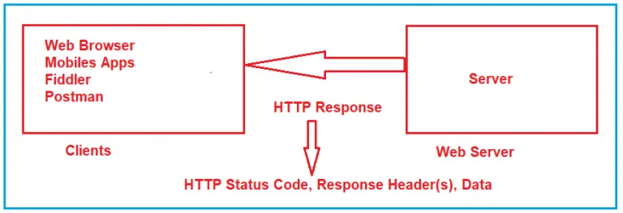
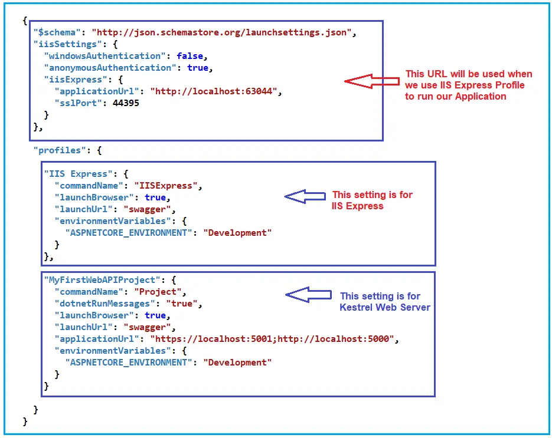
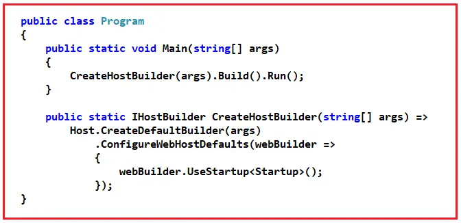

# C# Web API Repository

Some Tools Need to development Web api

    1.Postman

2. **swigger**

### **Need for Web APIs:**

As you can see in the below image, on the left-hand side, we have all three applications and on the right-hand side, we have the database as shown in the below image.

Our goal is to establish communication between all these three applications and the database. So, what we will do? We will add a new Web API Project. This Web API Project will interact with the database. And all three applications will only interact with the Web API Project as shown in the below image.

So, these websites, Android, and iOS applications do not have direct access to the database. They only need to communicate with the Web API project and it is the Web API project’s responsibility to interact with the database. And the entire business logic will be written in the Web API project only and this is the reason why we need Web API for our project. So, Web API acts as a mediator between the front end and backend.

**How Browser and Server Communicate with Each Other**

HTTP stands for HyperText Transport Protocol. HTTP is used for communication between the client and server. Let us understand what it means by client and server with an example.

Suppose, you open the web browser, type the URL in the browser and press the enter button. As soon as you press enter, a request is going to the server (called a web server). Whatever data you are sending from the web browser to the web server is called a Request and whatever data you are receiving from the web server is called a Response. This is how the browser and web server communicate with each other in the form of Requests and Responses. And this type of communication is only possible by using HTTP Protocol. So, the request can be termed as HTTP Request and the response can be called HTTP Response. For a better understanding, please have a look at the following image.

##### **HTTP**

Hypertext Transfer Protocol (often abbreviated to HTTP) is a communications protocol. It is used to send and receive web pages and files on the internet.

The Hypertext Transfer Protocol (HTTP) is an application layer protocol for distributed, collaborative, hypermedia information systems. HTTP is the foundation of data communication for the World Wide Web, where hypertext documents include hyperlinks to other resources that the user can easily access

#### **HTTP Request Components:**

1. **URL** : Each Request must have a unique URL
2. **Verb (Method):** Each Request must have an HTTP Verb.
3. **Header(s):** Each Request can contain one or more Headers.
4. **Body** : Each request can have a body. The body contains the data that we want to send to the server.

   

##### **HTTP Response Components:**

1. **HTTP Status Code:** It must have a Status Code.
2. **Response Headers:** It can have one or more response headers.
3. **Data** : Response can have data i.e. return to the client.

   

##### **HTTP Verbs or HTTP Methods:**

**GET Method:**

The GET HTTP Method is used to Retrieve the Data. The HTTP GET method requests a representation of the specified resource. Requests using GET should only be used to request data (they shouldn’t include data)

**POST Method:**

The POST request is used to make a new entry in the database. It is not only specific to a database, whenever you want to create a new resource in your application, then you need to use the POST method.

**PUT Method:**

PUT is also one of the HTTP Verb. The PUT method is used to update all the properties of the current resource in the database. What does it mean? For Example, we have a table called Product in our database. If we want to update all properties of a particular product (i.e. current resource) then we need to use PUT HTTP Request. So, whenever you want to update all the properties (column) of a resource (existing record in the database), then you need to use PUT Method. You cannot add a new resource using the PUT method.

**PATCH Method:**

There are some situations where you don’t want to update all the properties of an existing resource instead you want to update a few of the properties, then you need to use the PATCH method. So, the PATCH method is similar to the PUT method, but it is used to update a few properties of the current resource in the database

**DELETE Method:**

The DELETE method is used to delete the resource from the database. That means you are removing or deleting an existing entity from your database. In modern applications, we use two concepts for deletion. One is Soft Delete and the other one is Hard Delete.

1. **Soft Delete:** In your table, if you have some column like IsDeleted or IsActive, or something similar to this and you just want to update that column, then you cannot use Delete Method. In that case, you need to use the PATCH method. This is because you are not deleting the record from the database, you just update the record.
2. **Hard Delete:** If you want to remove the existing entity from the table, then you need to use the DELETE method. For example, Delete an existing product from the Product table in the database, etc.

##### **HTTP Status Codes:**

The HyperText Transport Protocol status code is also one of the important components of HTTP Response. The Status code is issued from the server and they give information about the response. Whenever we get any response from the server to the client, in that HTTP Response, we must have one HTTP Status code. All the HTTP Status codes are divided into five categories. They are as follows. Here, XX will represent the actual number.

1. **1XX** : Informational Response (Ex: 100, 101, 102, etc.)
2. **2XX** : Successful, whenever you get 2XX as the response code, it means the request is successful. (Ex. 200, 201, 203, etc.)
3. **3XX** : Redirection, whenever you get 3XX as the response code, it means it is re-directional i.e. some re-directional is happening on the server. (Ex. 300, 301, etc.)
4. **4XX** : Client Error, whenever you get 4XX as the response code, it means there is some problem with your request. (Ex: 400, 404, etc.)
5. **5XX** : Server Error. Whenever you get 5XX as the response code, it means there is some problem in the server. (Ex: 500, etc.).

## **SP.NET Core Web API using Postman**

##### **Selecting HTTP Method:**

##### **Enter the Request URL:**

**Params:** If you want to send any parameters then you need to set those parameters as key-value pairs in the Params tab. In our example, we not going to pass any parameters to the Web API, so we keep this empty.

##### **Authorization**

##### **Headers:**

The next one is the Headers tab. As you can see, the postman by default sends the following headers to the Web API. If your API needs some additional headers, then you can set those headers here only in the form of Key-Value Pairs. In our example, the API does not require any additional headers. So, we are only going with the default headers.

##### **Body:**

If your API accepts some data in the body, then you can send such data in the body tab. Further depending upon the type of data you can choose form-data, raw, binary, etc as shown in the below image. As our API is a GET request, as it doesn’t require any data, so none is selected by default.

##### **Folders and Files in ASP.NET Core Web API:**

##### **Dependencies:**

**Packages:**

At the moment the Packages folder contains one package i.e. Swashbuckle.AspNetCore. If you remember when we run the application, then it opens the swagger page. This package is basically for Swagger. Later if you add any new packages to your project, then that package will be shown here.

##### **Properties**

##### **Controllers:**

##### **appsettings.json file:**

##### **Program.cs class file:**

## **Middleware in ASP.NET Core Web API**

##### **HTTP Request Pipeline:**

Before understanding ASP.NET Core Middleware components, let us first understand what is HTTP Request Pipeline and how does it work. Please have a look at the following image for a better understanding of the HTTP Request Pipeline. As you can see in the below image, on the left-hand side, we have the client i.e. a browser and on the right-hand side, we have the server where our ASP.NET Core Web API application is hosted. Further, the Web API Application has three controllers. So, when the client sends a request to the server, we generally believe that it is the controller action method that is going to serve the request and then we get the response.

But in reality, before hitting the controller action method, the request has to pass through a pipeline. Once the pipeline is completed, then only it navigates the request to the corresponding controller action method as shown in the below image.

##### **HTTP Request Pipeline in ASP.NET Core Web API Application:**

The Request Pipeline in ASP.NET Core Web API Application can have multiple middlewares as shown in the below image. If you are confusing what is Middleware, let us assume a middleware is a piece of code with some logic. Whenever a request comes from a client to the server, then the request comes to the first middleware which is registered in the request pipeline

##### **Middleware in ASP.NET Core Web API:**

Middleware is a piece of code that is used in the HTTP Request Pipeline. An ASP.NET Core Web API Application can have n numbers of middleware. So, depending upon the requirement, we can configure n numbers of middleware in the application request processing pipeline.

The order of middleware matters a lot in the execution. That means in the order they are configured into the request processing pipeline; in the same order, they are going to be executed when a request comes. Each middleware in the ASP.NET Core Web API Application performs the following tasks.

1. Chooses whether to pass the HTTP Request to the next component in the pipeline. This can be achieved by calling the next() method within the middleware.
2. Can perform work before and after the next component in the pipeline.

ASP.NET Core provides some built-in middleware that is ready to be used, even if you want then you can also create your own custom middleware. The most important point that you need to keep in mind is, in ASP.NET Core a given Middleware component should only have a specific purpose i.e. single responsibility.

##### **Middleware Examples:**

1. **Routing** : If you want to implement Routing in your application, then you need to use Routing Middleware in the HTTP Request Processing pipeline.
2. **Authentication** : If you want to authenticate the user then you need to use Authentication Middleware.
3. **Authorize** : The Authorize Middleware is used to Authorize the users while accessing a specific resource.
4. **Log** : If you want to log request and response while processing, then you need Middleware.
5. **Exception Middleware:** You can also use Middleware to handle the exception globally.

 **Note** : The Middleware in ASP.NET Core Web API Application is used to set up the HTTP Request processing pipeline. If you have prior experience of the previous .NET Framework then you may know, HTTP Handlers and HTTP Modules which are basically used to set up the request processing pipeline. It is this pipeline that will determine how the HTTP request and response are going to be processed.

##### **Configure Middleware Components in ASP.NET Core application**

In the ASP.NET Core Web API application, the Middleware components are configured within the Configure method of the Startup class. The Startup class is the class that is going to run when the application starts. The following is the Configure method of the Startup class that we have created in our previous article. Even though if you created an ASP.NET Core Application with an Empty Project template, then also you will find the following code within the Configure method of the Startup class.

As you can see in the above image, within the Configure method we have configured three Middleware components to the HTTP Request Processing Pipeline. They are as follows.

1. **UseDeveloperExceptionPage() Middleware:**The UseDeveloperExceptionPage() middleware will come into picture only when the hosting environment is set to “development”. The UseDeveloperExceptionPage middleware is going to execute when there is an unhandled exception that occurred in the application and since it is in development mode, it is going to show you the detailed information of the exception.
2. **UseRouting() Middleware:**The UseRouting middleware is used to add Endpoint Routing Middleware to the request processing pipeline i.e. it will map the URL (or incoming HTTP Request) to a particular resource.
3. **UseEndpoints() Middleware:**In this middleware, the routing decisions are going to be taken using the Map extension method.

So, if you want to configure any middleware components in any type of ASP.NET Core applications, then you need to configure it within the Configure method by calling the **Use*** methods on the IApplicationBuilder object.

**Note:**The ASP.NET Core Middleware components are executed in the same order as they are added to the pipeline. So, it is our key responsibility to take care when adding middleware components.

##### **Run, Use, Next, and Map Methods in Middleware:**

In order to work with ASP.NET Core Middleware Components, we need to learn about few methods are as follows:

1. **Run() Method:** The [**Run() Extension Method**](https://dotnettutorials.net/lesson/run-method-in-asp-net-core/) is used to complete the Middleware Execution.
2. **Use() Method:** The Use() Extension Method is used to insert a new Middleware component to the Request Processing Pipeline.
3. **Next() Method:** The Next() Extension Method is used to call the next middleware component in the request processing pipeline.
4. **Map() Method:** The Map() Extension Method is used to map the Middleware to a specific URL.
